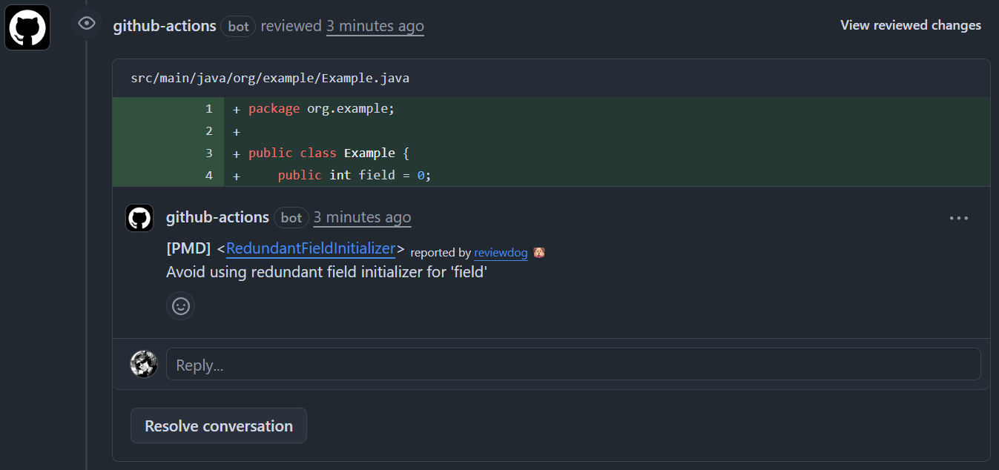
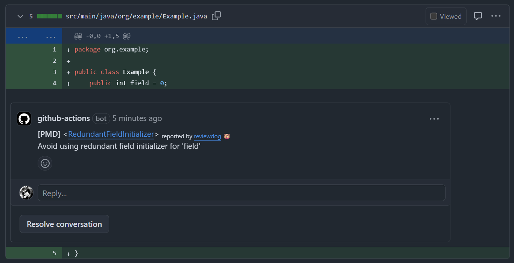

# PMD Reviewdog Reporter

Run [PMD](https://pmd.github.io/) static analysis on your code and report issues as GitHub PR comments
via [reviewdog](https://github.com/reviewdog/reviewdog).

ℹ️ **Note**: This action only integrates PMD with reviewdog.\
If you want GitHub annotations instead of reviewdog comments,
use the
original [pmd-github-action](https://github.com/pmd/pmd-github-action).

---

## Example Output

By default, this action uses the `github-pr-review` reporter mode.  
In this mode, reviewdog posts PMD findings as PR comments, which you can see in different tabs:

- **Conversation tab**
  

- **Files Changed tab**
  

## Usage

```yaml
name: PMD Check

on:
  pull_request:
    paths:
      - '**/*.java'

jobs:
  pmd-review:
    runs-on: ubuntu-latest
    steps:
      - name: Checkout
        uses: actions/checkout@v5

      - name: Set up Java
        uses: actions/setup-java@v5
        with:
          distribution: temurin
          java-version: 21

      - name: Run PMD + Reviewdog
        uses: RodionKorneev/pmd-reviewdog-action@v1
        with:
          rulesets: 'rulesets/java/quickstart.xml'
```

⚠️ **Java must be installed** on the runner, since PMD runs on the Java Virtual Machine.

This is **not handled by the action itself** because:

- The required Java version may vary between projects.
- Users may already have Java installed on the runner.
- GitHub-hosted runners or self-hosted runners may use different Java distributions.

Therefore, the action assumes that a compatible Java runtime is already available in the environment.

## Inputs

|          Input          |       Default       | Description                                                                                                                                                                                                                    |
|:-----------------------:|:-------------------:|--------------------------------------------------------------------------------------------------------------------------------------------------------------------------------------------------------------------------------|
|       `rulesets`        |    ⚠️**Requred**    | <p>Comma-separated list of PMD rulesets to use.</p><p>You can use default rulesets provided by PMD, or create your own custom ruleset and reference it.</p><p>See `rulesets` in https://github.com/pmd/pmd-github-action. </p> |
|     `github_token`      | `${{github.token}}` | GitHub token used by PMD to determine modified files and by reviewdog to post comments.                                                                                                                                        |
|      `pmd_version`      |      `latest`       | <p>PMD version to use. Using `latest` automatically downloads the latest release.</p><p>Available versions: https://github.com/pmd/pmd/releases. </p><p>See `version` in https://github.com/pmd/pmd-github-action. </p>        |
|   `pmd_download_url`    |                     | <p>Optionally specify a custom URL for downloading the PMD binary.</p><p>See `downloadUrl` in https://github.com/pmd/pmd-github-action. </p>                                                                                   |
|        `workdir`        |         `.`         | <p>Directory to run PMD in.</p><p>See `sourcePath` in https://github.com/pmd/pmd-github-action. </p>                                                                                                                           |
| `analyze_modified_only` |       `false`       | <p>Only analyze files modified in a PR or push instead of all files in `workdir`.</p><p>See `analyzeModifiedFilesOnly` in https://github.com/pmd/pmd-github-action. </p>                                                       |
|  `upload_sarif_report`  |       `true`        | <p>Upload generated SARIF report as artifact named "PMD Report".</p><p>See `uploadSarifReport` in https://github.com/pmd/pmd-github-action. </p>                                                                               |
|   `reviewdog_version`   |      `latest`       | <p>Reviewdog version.</p><p>See `reviewdog_version` in https://github.com/reviewdog/action-setup. </p>                                                                                                                         |
|       `tool_name`       |        `PMD`        | Tool name for reviewdog reporter.                                                                                                                                                                                              |
|       `reporter`        | `github-pr-review`  | <p>Reviewdog reporter type.</p><p>See available options at: https://github.com/reviewdog/reviewdog#reporters </p>                                                                                                              |
|         `level`         |       `error`       | Reviewdog report level (`info`, `warning`, `error`).                                                                                                                                                                           |
|      `fail_level`       |        `any`        | <p>Reviewdog fail level. Determines at which level the step fails.</p><p>See https://github.com/reviewdog/reviewdog?tab=readme-ov-file#exit-codes. </p>                                                                        |
|      `filter_mode`      |     `nofilter`      | <p>Reviewdog filtering mode.</p><p>See https://github.com/reviewdog/reviewdog?tab=readme-ov-file#filter-mode. </p>                                                                                                             |
|    `reviewdog_flags`    |                     | Additional flags to pass to reviewdog command.                                                                                                                                                                                 |

## Outputs

This action does not produce outputs, all results are reported via reviewdog in PR comments or GitHub checks.

## How it Works

This action is a **composite GitHub Action** that combines:

1. [pmd/pmd-github-action](https://github.com/pmd/pmd-github-action) — runs PMD static analysis.
2. [reviewdog/action-setup](https://github.com/reviewdog/action-setup) — installs reviewdog CLI.

All inputs you provide to `pmd-reviewdog-action` are used as follows:

- `rulesets`, `workdir`, `pmd_version`, etc. → forwarded to `pmd/pmd-github-action`.
- `tool_name`, `reporter`, `level`, `fail_level`, `filter_mode`, `reviewdog_flags` → passed to the **reviewdog CLI**
  when reporting issues.

A few internal parameters are handled internally, but in general you can configure PMD analysis and reviewdog reporting
in a way very similar to using the underlying tools directly.

## License

This action is licensed under the MIT License © Rodion Korneev.
